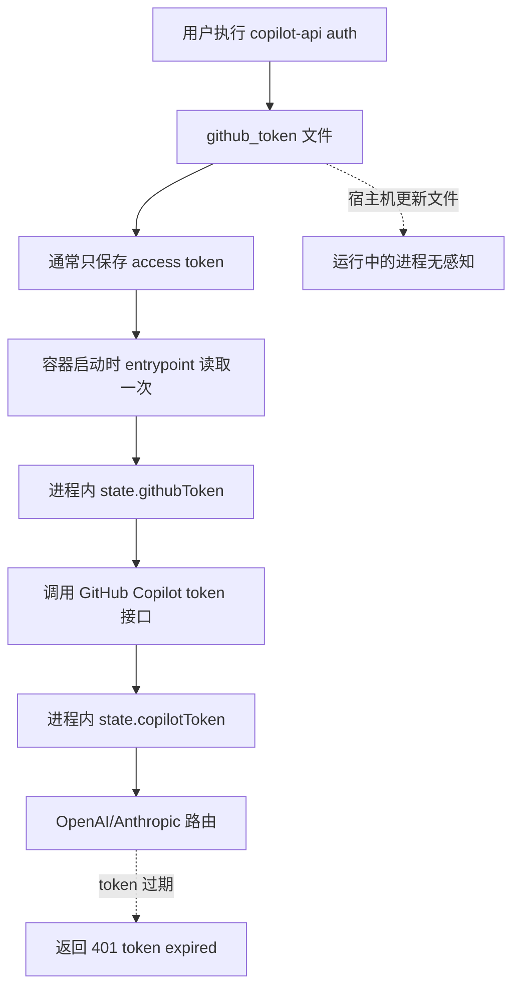
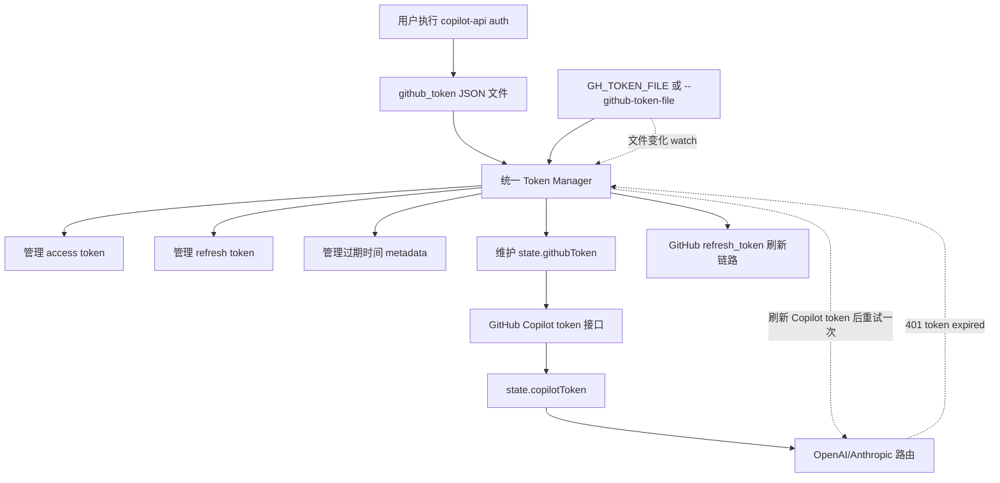
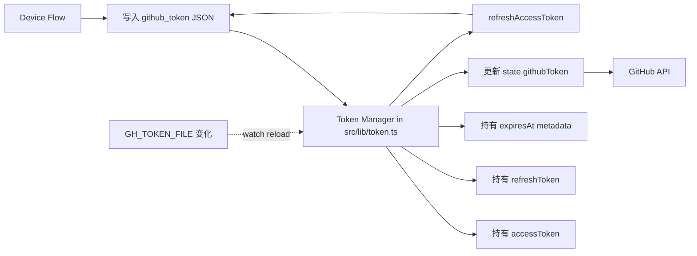
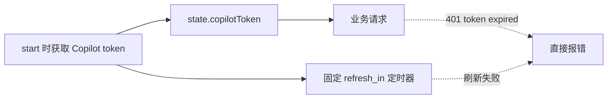
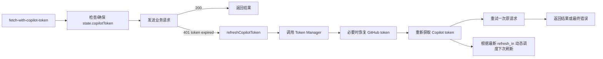

# Copilot API Proxy 中文说明

[English README](./README.md)

> [!WARNING]
> 这是一个基于逆向工程实现的 GitHub Copilot API 代理，并非 GitHub 官方支持产品，随时可能因上游变更失效。请自行承担使用风险。

## 项目概览

这个项目把 GitHub Copilot 暴露为 OpenAI 兼容和 Anthropic 兼容接口，方便接入 Claude Code 以及其他支持这两类 API 的工具。

这份中文 README 重点解释最近这次认证链路改造，尤其是：

- GitHub token 持久化从“只存 access token”升级为“可保存 refresh metadata，并自动 refresh”
- Copilot token 从“启动时拿一次 + 固定定时器刷新”升级为“动态调度刷新，并在 `401 token expired` 时自动重试”

## 这次改造解决了什么

改造前，运行中的服务存在两个核心短板：

- GitHub token 文件里通常只有 access token，缺少 refresh token 和过期信息
- 即使宿主机重新执行了 `copilot-api auth`，容器内运行中的进程也不会自动感知这个更新
- Copilot IDE token 过期后，请求路径只会直接报 `401 token expired`，不会自愈

因此你会遇到两类典型问题：

- 长时间运行后又要重新执行 `copilot-api auth`
- 即便宿主机已经重新 `auth`，容器往往还要重启后才恢复

## 改造前后的总体对比

### 改造前



### 改造后



## 核心改动 1：GitHub token 持久化升级

核心实现文件：

- [src/lib/token.ts](/Users/ken/Desktop/code/ai/copilot-api/src/lib/token.ts)

### 改造前

GitHub token 的思路基本是：

- `auth` 完成 device flow
- 只把 access token 写入本地文件
- `start` 时读出这个 token 放进内存
- 后续默认长期使用它

对应的问题：

- access token 过期后，进程本身没有完整续期能力
- 容器如果只是把宿主机文件在启动时读成 `-g "$GH_TOKEN"` 参数，那么宿主机后续更新文件也不会影响运行中的进程
- 一旦 access token 过期，又没有可用 refresh 逻辑，就只能重新 `auth`

### 改造后

现在 `src/lib/token.ts` 把 GitHub token 当成一个受管理的生命周期对象处理：

- 支持把 token 文件解析为结构化 JSON
- 持久化 `accessToken`
- 持久化 `refreshToken`
- 持久化 `accessTokenExpiresAt`
- 持久化 `refreshTokenExpiresAt`
- 启动时优先读取 `--github-token-file` / `GH_TOKEN_FILE`
- 如果 access token 快过期且 refresh token 仍有效，则自动走 refresh flow
- 如果 watched token file 在运行时变化，会自动 reload 到内存

### GitHub token 链路对比图

#### 改造前


#### 改造后



### 这部分带来的直接收益

- 不再依赖“access token 一直有效”这个脆弱假设
- 长期运行的服务更容易自动续期
- 宿主机重新 `auth` 后，使用 watched token file 的容器无需重启即可吸收更新

## 核心改动 2：Copilot token 动态调度与 401 自愈

核心实现文件：

- [src/services/copilot/fetch-with-copilot-token.ts](/Users/ken/Desktop/code/ai/copilot-api/src/services/copilot/fetch-with-copilot-token.ts)
- [src/lib/token.ts](/Users/ken/Desktop/code/ai/copilot-api/src/lib/token.ts)

### 改造前

Copilot token 的思路是：

- 启动时调用一次 GitHub Copilot token 接口
- 把返回的 token 放进 `state.copilotToken`
- 根据最初拿到的 `refresh_in` 设置一个固定刷新定时器
- 正常请求路径自己不处理 token 失效

这样的问题是：

- 如果某次后台刷新失败，请求路径没有兜底
- 如果上游直接返回 `401 token expired`，请求只会报错返回
- 即使宿主机 token 文件已经更新，原有请求路径也不会自动触发完整恢复

### 改造后

现在请求路径统一接到 `fetch-with-copilot-token.ts`：

- 请求前如有需要先确保 Copilot token 可用
- 如果请求结果正常，直接返回
- 如果返回 `401 token expired`，先触发 token 恢复
- 恢复时会尝试：
  - 重新加载 watched GitHub token file
  - 或使用已有 refresh token 刷新 GitHub access token
  - 然后重新获取 Copilot token
- 成功后自动重试一次原请求

### Copilot token 链路对比图

#### 改造前



#### 改造后



### 这部分带来的直接收益

- `401 token expired` 不再等同于人工介入
- token 刷新失败时不再只有“报错”这一条路
- 定时刷新不再完全依赖首次拿到的那一组参数，而是每次刷新后基于最新返回值重新调度

## Docker 行为变化

之前容器常见的运行方式是：

- 把宿主机 token 文件挂载进容器
- 入口脚本只在启动时 `cat "$GH_TOKEN_FILE"`
- 再把读出来的值作为 `-g "$GH_TOKEN"` 传给进程

这样的问题是：

- 运行中即便挂载文件变了，进程也不知道

现在更推荐的方式是：

- 直接通过 `GH_TOKEN_FILE` 或 `--github-token-file` 把文件路径交给应用
- 由应用在运行时自己读取、watch、reload 和 refresh

### 容器启动链路对比图

#### 改造前

```mermaid
flowchart TD
  A[宿主机 github_token 文件] --> B[/run/secrets/gh_token]
  B --> C[entrypoint.sh 启动时 cat 一次]
  C --> D[-g GH_TOKEN]
  D --> E[应用进程]
  A -. 后续文件变化 .-> F[进程无感知]
```

#### 改造后

```mermaid
flowchart TD
  A[宿主机 github_token 文件] --> B[/run/secrets/gh_token]
  B --> C[GH_TOKEN_FILE / --github-token-file]
  C --> D[应用内 Token Manager]
  B -. 文件变化 watch .-> D
  D --> E[更新内存中的 GitHub token 状态]
  D --> F[触发 Copilot token 刷新]
  F --> G[业务请求恢复]
```

## 推荐使用方式

### 本地或宿主机先执行一次 auth

```sh
npx copilot-api@latest auth
```

### 长期运行服务时优先使用 watched token file

```sh
npx copilot-api@latest start --github-token-file ~/.local/share/copilot-api/github_token
```

### Docker 推荐方式

```sh
docker run \
  -p 4141:4141 \
  -v ~/.local/share/copilot-api/github_token:/run/secrets/gh_token:ro \
  -e GH_TOKEN_FILE=/run/secrets/gh_token \
  copilot-api
```

## 一句话总结

这次改造的本质是把认证模型从“登录一次，尽量撑着用”改成了“把 GitHub token 和 Copilot token 都纳入运行时生命周期管理”。

最关键的两点就是：

- [src/lib/token.ts](/Users/ken/Desktop/code/ai/copilot-api/src/lib/token.ts) 负责 GitHub token 的结构化持久化、自动 refresh、文件 watch 与恢复
- [src/services/copilot/fetch-with-copilot-token.ts](/Users/ken/Desktop/code/ai/copilot-api/src/services/copilot/fetch-with-copilot-token.ts) 负责 Copilot 请求路径上的 `401 token expired` 自愈与重试
