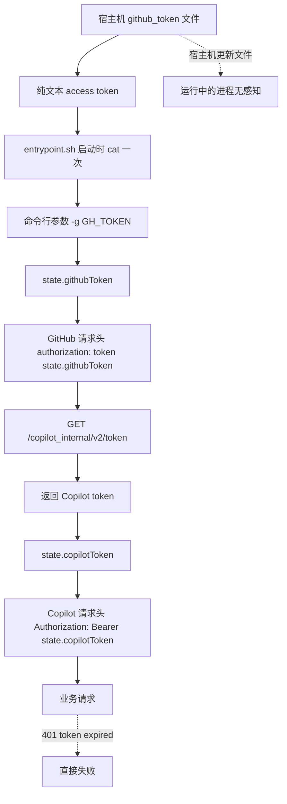
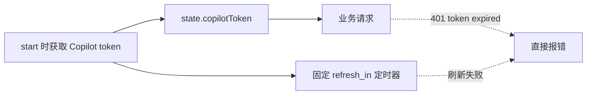
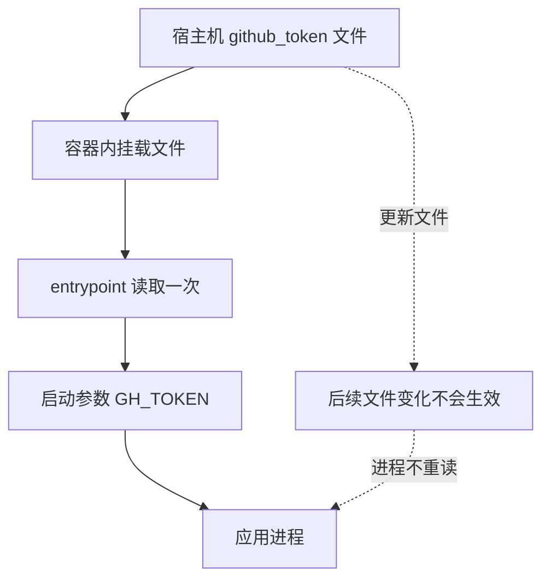

# Copilot API Proxy 中文说明

[English README](./README.md)

> [!WARNING]
> 这是一个基于逆向工程实现的 GitHub Copilot API 代理，并非 GitHub 官方支持产品，随时可能因上游变更失效。请自行承担使用风险。

## 项目概览

这个项目把 GitHub Copilot 暴露为 OpenAI 兼容和 Anthropic 兼容接口，方便接入 Claude Code 以及其他支持这两类 API 的工具。

## 架构说明

### 请求流量走向

根据客户端协议不同，请求分两条路径处理：

```
┌─────────────────────────────────────────────────────────────┐
│                         客户端                               │
│                                                             │
│  Anthropic 格式                  OpenAI 格式                 │
│  POST /v1/messages               POST /v1/chat/completions   │
└────────────┬─────────────────────────────┬──────────────────┘
             │                             │
             ▼                             ▼
┌────────────────────────────────────────────────────────────┐
│                   Hono HTTP Server                          │
│                   src/server.ts                             │
│                                                             │
│  /v1/messages ──► messages/handler.ts                       │
│                   translateToOpenAI()    ◄── 格式转换        │
│                                                             │
│  /v1/chat/completions ──► chat-completions/handler.ts       │
│                           （原生 OpenAI 格式，无需转换）       │
└────────────────────────────┬───────────────────────────────┘
                             │
                             │  两条路径在此汇合
                             ▼
┌────────────────────────────────────────────────────────────┐
│              createChatCompletions()                        │
│        src/services/copilot/create-chat-completions.ts      │
│                                                             │
│  携带：Authorization: Bearer ${state.copilotToken}          │
│  目标：https://api.githubcopilot.com                        │
└────────────────────────────┬───────────────────────────────┘
                             │
                             ▼
                    GitHub Copilot API
                             │
                             ▼
┌────────────────────────────────────────────────────────────┐
│                      响应路径                                │
│                                                             │
│  /v1/messages ──► translateToAnthropic()  （格式转回）       │
│  /v1/chat/completions ──► 直接透传                           │
│                                                             │
│  两条路径均：enqueueRequestLog() ──► SQLite 异步写入          │
└────────────────────────────────────────────────────────────┘
```

### Anthropic ↔ OpenAI 格式转换

到达 `/v1/messages` 的请求经过双向翻译层（`src/routes/messages/`）：

| 方向 | 函数 | 文件 |
|---|---|---|
| 请求：Anthropic → OpenAI | `translateToOpenAI()` | `non-stream-translation.ts` |
| 响应：OpenAI → Anthropic（非流式）| `translateToAnthropic()` | `non-stream-translation.ts` |
| 响应：OpenAI → Anthropic（流式）| `translateChunkToAnthropicEvents()` | `stream-translation.ts` |

关键字段映射（Anthropic → OpenAI）：

| Anthropic 字段 | OpenAI 字段 | 备注 |
|---|---|---|
| `model` | `model` | 经 `resolveModelName()` 解析 |
| `max_tokens` | `max_tokens` | 非 GPT-5 模型 |
| `max_tokens` | `max_completion_tokens` | GPT-5 模型专用 |
| `stop_sequences` | `stop` | |
| `system`（字符串或 block 数组）| `messages[0]` role=`system` | block 数组以 `\n\n` 合并为文本 |
| 用户侧 `tool_result` blocks | role=`tool` messages | 拆成独立消息 |
| 助手侧 `tool_use` blocks | `tool_calls` 数组 | |
| `thinking` blocks | 合并进 `content` 文本 | OpenAI 无 thinking 概念 |
| `tool_choice: any` | `"required"` | |
| `tool_choice: tool` | `{type:"function", function:{name}}` | |
| tools `input_schema` | tools `parameters` | |

> **注意**：`thinking` blocks 是单向有损转换——它们会被合并为普通文本发给 Copilot，但 Copilot 的响应中不会包含 thinking blocks。

### 模型名称解析

每条请求的模型名称在到达 Copilot 之前，都会经过 `resolveModelName()`（`src/lib/model-map.ts`）：

```
请求中的模型名称
        │
        ▼
1. SQLite alias 查找（model_aliases 表，内存缓存）
        │ 命中 → 返回别名目标
        │ 未命中 ↓
2. 精确匹配 state.models 列表
        │ 命中 → 原名
        │ 未命中 ↓
3. Dash-to-dot 转换（如 claude-sonnet-4-6 → claude-sonnet-4.6）
   （可在 Dashboard 设置中关闭）
        │ 命中 → 匹配名
        │ 未命中 ↓
4. 透传（原样发给 Copilot）
```

### 数据层（SQLite）

所有运行时数据持久化到单一 SQLite 数据库（WAL 模式）：

| 表 | 用途 |
|---|---|
| `request_logs` | 异步请求日志；用于 Dashboard 趋势图、最近请求、费用估算 |
| `model_aliases` | 请求路径别名解析；以 `(source_model, enabled)` 为复合主键，启动时加载到内存缓存，写入后自动刷新 |
| `dashboard_meta` | Dashboard 设置（日志保留策略、dash-to-dot 开关等） |
| `openrouter_pricing_cache` | OpenRouter 定价每日快照；用于估算等价费用 |

默认数据库路径：`~/.local/share/copilot-api/copilot-api.db`，通过 `COPILOT_API_DB_PATH` 覆盖。

---

这份中文 README 以下内容重点解释最近这次认证链路改造，尤其是：

- GitHub token 持久化从“只存 access token”升级为“可保存 refresh metadata，并自动 refresh”
- Copilot token 从“启动时拿一次 + 固定定时器刷新”升级为“动态调度刷新，并在 `401 token expired` 时自动重试”

## 这次改造解决了什么

改造前，运行中的服务存在两个核心短板：

- GitHub token 文件里通常只有 access token，缺少 refresh token 和过期信息
- 即使宿主机重新执行了 `copilot-api auth`，容器内运行中的进程也不会自动感知这个更新
- Copilot IDE token 过期后，请求路径只会直接报 `401 token expired`，不会自愈

因此你会遇到两类典型问题：

- 长时间运行后又要重新执行 `copilot-api auth`
- 即便宿主机已经重新 `auth`，容器往往还要重启后才恢复

## 改造前后的总体对比

先看两个关键映射，后面的图都围绕这两个事实展开：

- `github_token` JSON 中的 `accessToken` 会写入 `state.githubToken`，然后用于 GitHub 请求头 `authorization: token ${state.githubToken}`
- GitHub `/copilot_internal/v2/token` 返回的 `token` 会写入 `state.copilotToken`，然后用于 Copilot 请求头 `Authorization: Bearer ${state.copilotToken}`

### 改造前



### 改造后

```text
GitHub Device Flow / 宿主机 copilot-api auth
                    |
                    v
+--------------------------------------------------+
| github_token JSON 文件                            |
|                                                  |
|  accessToken               -> GitHub access token |
|  refreshToken              -> GitHub refresh token|
|  accessTokenExpiresAt      -> access token 过期点 |
|  refreshTokenExpiresAt     -> refresh token 过期点|
|  updatedAt                 -> 最近更新时间        |
+--------------------------------------------------+
                    |
                    | 整体读取 / watch 文件变化
                    v
+--------------------------------------------------+
| src/lib/token.ts                                 |
| Token Manager                                    |
|                                                  |
|  1. 读取整个 github_token JSON                   |
|  2. 取 accessToken -> state.githubToken          |
|  3. 取 expiresAt -> 判断 access token 是否快过期 |
|  4. 必要时用 refreshToken 刷新 GitHub token      |
|  5. 回写 github_token JSON                       |
|  6. 用 state.githubToken 去换 Copilot token      |
+--------------------------------------------------+
                    |
                    v
state.githubToken
                    |
                    v
GitHub 请求头: authorization: token ${state.githubToken}
                    |
                    v
GET /copilot_internal/v2/token
                    |
                    v
response.token -> state.copilotToken
                    |
                    v
Copilot 请求头: Authorization: Bearer ${state.copilotToken}
                    |
                    v
业务请求
```

## 核心改动 1：GitHub token 持久化升级

核心实现文件：

- [src/lib/token.ts](/Users/ken/Desktop/code/ai/copilot-api/src/lib/token.ts)

### 改造前

GitHub token 的思路基本是：

- `auth` 完成 device flow
- 只把 access token 写入本地文件
- `start` 时读出这个 token 放进内存
- 后续默认长期使用它

对应的问题：

- access token 过期后，进程本身没有完整续期能力
- 容器如果只是把宿主机文件在启动时读成 `-g "$GH_TOKEN"` 参数，那么宿主机后续更新文件也不会影响运行中的进程
- 一旦 access token 过期，又没有可用 refresh 逻辑，就只能重新 `auth`

### 改造后

现在 `src/lib/token.ts` 把 GitHub token 当成一个受管理的生命周期对象处理：

- 支持把 token 文件解析为结构化 JSON
- 持久化 `accessToken`
- 持久化 `refreshToken`
- 持久化 `accessTokenExpiresAt`
- 持久化 `refreshTokenExpiresAt`
- 启动时优先读取 `--github-token-file` / `GH_TOKEN_FILE`
- 如果 access token 快过期且 refresh token 仍有效，则自动走 refresh flow
- 如果 watched token file 在运行时变化，会自动 reload 到内存

字段和运行态之间的关系是：

- `github_token.accessToken` -> `state.githubToken`
- `github_token.refreshToken` -> `currentGitHubToken.refreshToken`
- `github_token.accessTokenExpiresAt` -> 判断是否需要刷新 GitHub access token
- `github_token.refreshTokenExpiresAt` -> 判断 refresh token 是否还可用于刷新
- `state.githubToken` -> `githubHeaders(state)` -> `authorization: token ${state.githubToken}`

### GitHub token 链路对比图

#### 改造前


#### 改造后

```text
+--------------------------------------------------+
| github_token JSON                                |
|                                                  |
|  accessToken                                     |
|  refreshToken                                    |
|  accessTokenExpiresAt                            |
|  refreshTokenExpiresAt                           |
+--------------------------------------------------+
                    |
                    v
+--------------------------------------------------+
| src/lib/token.ts  Token Manager                  |
+--------------------------------------------------+
| 读取 accessToken            -> state.githubToken |
| 读取 accessTokenExpiresAt   -> 判断是否快过期    |
| 读取 refreshToken           -> 刷新时使用        |
| 读取 refreshTokenExpiresAt  -> 判断是否还能刷新  |
+--------------------------------------------------+
                    |
                    +--> accessToken 未过期
                    |       |
                    |       v
                    |   直接使用 state.githubToken
                    |
                    +--> accessToken 快过期
                            |
                            +--> refreshToken 仍有效
                                    |
                                    v
                              POST /login/oauth/access_token
                              grant_type=refresh_token
                                    |
                                    v
                              返回新的 access_token /
                              refresh_token / expires_in
                                    |
                                    v
                              normalizeGitHubToken
                                    |
                                    +--> 回写 github_token JSON
                                    |
                                    +--> 更新 state.githubToken
```

### 这部分带来的直接收益

- 不再依赖“access token 一直有效”这个脆弱假设
- 长期运行的服务更容易自动续期
- 宿主机重新 `auth` 后，使用 watched token file 的容器无需重启即可吸收更新

## 核心改动 2：Copilot token 动态调度与 401 自愈

核心实现文件：

- [src/services/copilot/fetch-with-copilot-token.ts](/Users/ken/Desktop/code/ai/copilot-api/src/services/copilot/fetch-with-copilot-token.ts)
- [src/lib/token.ts](/Users/ken/Desktop/code/ai/copilot-api/src/lib/token.ts)

### 改造前

Copilot token 的思路是：

- 启动时调用一次 GitHub Copilot token 接口
- 把返回的 token 放进 `state.copilotToken`
- 根据最初拿到的 `refresh_in` 设置一个固定刷新定时器
- 正常请求路径自己不处理 token 失效

这样的问题是：

- 如果某次后台刷新失败，请求路径没有兜底
- 如果上游直接返回 `401 token expired`，请求只会报错返回
- 即使宿主机 token 文件已经更新，原有请求路径也不会自动触发完整恢复

### 改造后

现在请求路径统一接到 `fetch-with-copilot-token.ts`：

- 请求前如有需要先确保 Copilot token 可用
- 如果请求结果正常，直接返回
- 如果返回 `401 token expired`，先触发 token 恢复
- 恢复时会尝试：
  - 重新加载 watched GitHub token file
  - 或使用已有 refresh token 刷新 GitHub access token
  - 然后重新获取 Copilot token
- 成功后自动重试一次原请求

这里最关键的工程逻辑是：

- 正常业务请求真正使用的是 `state.copilotToken`
- `state.copilotToken` 来自 `getCopilotToken()` 的响应字段 `token`
- `getCopilotToken()` 这一步使用的认证头不是 Copilot token，而是 GitHub token：
  `authorization: token ${state.githubToken}`
- 所以 `401 token expired` 之后，恢复顺序不是“直接刷新旧 Copilot token”，而是：
  1. 先确认 `state.githubToken` 还可用，必要时用 `refreshToken` 刷新它
  2. 再调用 GitHub `/copilot_internal/v2/token` 重新拿一个新的 Copilot token
  3. 把新 token 写回 `state.copilotToken`
  4. 用新的 `Authorization: Bearer ${state.copilotToken}` 重试一次原请求

### Copilot token 链路对比图

#### 改造前



#### 改造后

```text
原 Copilot 请求
  |
  v
Authorization: Bearer ${state.copilotToken}
  |
  v
Copilot API
  |
  +--> 200
  |      |
  |      v
  |    直接返回
  |
  +--> 401 token expired
         |
         v
   fetch-with-copilot-token.ts
         |
         v
   refreshCopilotToken()
         |
         v
   src/lib/token.ts Token Manager
         |
         | 先处理 GitHub token，而不是直接复用旧 Copilot token
         |
         +--> 检查 github_token JSON 中的 accessTokenExpiresAt
         |
         +--> 如果 GitHub access token 快过期
         |      且 refreshToken 仍有效
         |      |
         |      v
         |    用 refreshToken 刷新 GitHub access token
         |      |
         |      v
         |    回写 github_token JSON
         |      |
         |      v
         |    更新 state.githubToken
         |
         v
   用 state.githubToken 请求 GitHub /copilot_internal/v2/token
         |
         v
   response.token -> state.copilotToken
         |
         v
   用新的 Bearer token 重试一次原 Copilot 请求
```

### 这部分带来的直接收益

- `401 token expired` 不再等同于人工介入
- token 刷新失败时不再只有“报错”这一条路
- 定时刷新不再完全依赖首次拿到的那一组参数，而是每次刷新后基于最新返回值重新调度

## Docker 行为变化

之前容器常见的运行方式是：

- 把宿主机 token 文件挂载进容器
- 入口脚本只在启动时 `cat "$GH_TOKEN_FILE"`
- 再把读出来的值作为 `-g "$GH_TOKEN"` 传给进程

这样的问题是：

- 运行中即便挂载文件变了，进程也不知道

现在更推荐的方式是：

- 直接通过 `GH_TOKEN_FILE` 或 `--github-token-file` 把文件路径交给应用
- 由应用在运行时自己读取、watch、reload 和 refresh

### 容器启动链路对比图

#### 改造前



#### 改造后

```text
宿主机 github_token JSON 文件
  |
  v
容器内挂载文件
  |
  v
GH_TOKEN_FILE / --github-token-file
  |
  v
src/lib/token.ts Token Manager
  |
  +--> 整体读取 github_token JSON
  |
  +--> 提取 accessToken / refreshToken / expiresAt
  |
  +--> 更新 state.githubToken
  |
  +--> 如有需要重新获取 state.copilotToken
  |
  v
业务请求恢复

另外：
容器内挂载文件发生变化
  |
  v
watcher 感知变化
  |
  v
Token Manager 重新读取整个 github_token JSON
```

## 推荐使用方式

> 以下示例使用源码运行方式。如果你是通过 npm 安装的（`npm install -g copilot-api`），把 `bun run start` 替换为 `copilot-api` 即可。

### 本地或宿主机先执行一次 auth

```sh
bun run start auth
```

### 长期运行服务时优先使用 watched token file

```sh
bun run start start --github-token-file ~/.local/share/copilot-api/github_token
```

### Docker 推荐方式

```sh
docker run \
  -p 4141:4141 \
  -v ~/.local/share/copilot-api/github_token:/run/secrets/gh_token:ro \
  -e GH_TOKEN_FILE=/run/secrets/gh_token \
  copilot-api
```

## 一句话总结

这次改造的本质是把认证模型从”登录一次，尽量撑着用”改成了”把 GitHub token 和 Copilot token 都纳入运行时生命周期管理”。

最关键的两点就是：

- [src/lib/token.ts](/Users/ken/Desktop/code/ai/copilot-api/src/lib/token.ts) 负责 GitHub token 的结构化持久化、自动 refresh、文件 watch 与恢复
- [src/services/copilot/fetch-with-copilot-token.ts](/Users/ken/Desktop/code/ai/copilot-api/src/services/copilot/fetch-with-copilot-token.ts) 负责 Copilot 请求路径上的 `401 token expired` 自愈与重试

---

## Dashboard 架构

Dashboard 由两部分组成：前端 SPA（构建后输出到 `dist/dashboard/`，由代理服务直接托管）和后端 API（挂载在 `/api/dashboard`）。

### API 路由结构

```
浏览器
  │
  ├── GET /dashboard           ← 静态 HTML 壳（src/routes/dashboard/assets.ts）
  ├── GET /dashboard/assets/*  ← JS/CSS 资源包
  │
  └── 调用 /api/dashboard/*
        │
        ▼
  createDashboardRoute()  (src/routes/dashboard/route.ts)
        │
        ├── GET /overview          ← 请求总量、错误率、延迟、token 统计（支持 timeFrom/timeTo 过滤）
        ├── GET /usage             ← 实时 Copilot 配额（转发自 GitHub API）
        ├── GET /models            ← 模型分布 + OpenRouter 费用估算（支持 timeFrom/timeTo 过滤）
        ├── GET /time-series       ← 可配置粒度的趋势分桶数据
        ├── GET /requests          ← 服务端分页的请求日志（支持过滤）
        ├── GET /requests/count    ← 分页用总计数
        ├── GET /supported-models  ← Copilot 支持的模型列表（来自 state.models 缓存）
        ├── GET /aliases           ← 别名列表 + 内存缓存快照
        ├── POST/PUT/DELETE /aliases/:id  ← 别名 CRUD，每次写入触发内存重新加载
        └── GET/POST /settings     ← dashboard_meta 配置 + sink 参数
```

### 请求日志数据流

每条 API 请求（包括 `/v1/messages` 和 `/v1/chat/completions`）都会经过异步多阶段管道写入日志：

```
请求处理器（messages/handler.ts 或 chat-completions/handler.ts）
        │
        │ enqueueRequestLog()
        ▼
Request Sink  (src/db/request-sink.ts)
  内存队列（最多 10,000 条，超出时丢弃最早的记录）
        │
        │ 每 500ms 批量刷写，每批最多 100 条
        ▼
writeBatch()  (src/db/runtime.ts)
        │
        ├── 对每条尚无定价的记录：
        │     OpenRouter 定价服务
        │       └── SQLite 每日快照（openrouter_pricing_cache）
        │             └── 快照过期时：请求 https://openrouter.ai/api/v1/models 更新
        │     → 补充估算 USD 费用字段
        │
        ▼
requestLogRepository.insertBatch()
        │
        ▼
SQLite: request_logs 表
        │
        └── 启动时 + 每 6 小时：清理超过保留期的记录
            （默认 15 天，可通过 Dashboard 设置或环境变量调整）
```

Sink 配置（刷写间隔、批大小、队列上限、重试策略）可在 Dashboard 的 Settings 页实时调整，变更会持久化到 `dashboard_meta`。

### 模型别名写入链路

Dashboard 中对别名的增删改立即生效，无需重启：

```
Dashboard UI  POST/PUT/DELETE /api/dashboard/aliases/:id
        │
        ▼
modelAliasRepository  （写入 SQLite model_aliases 表）
        │
        ▼
modelAliasStore.reload()  （重建内存 Map）
        │
        ▼
resolveModelName()  下一条请求即使用最新的映射
```

`model_aliases` 使用 `(source_model, enabled)` 作为复合主键，同时保留 `id` 作为 Dashboard 编辑/删除时使用的稳定行标识。同一个请求模型可以同时保留一条启用配置和一条停用配置；同一请求模型 + 同一状态重复写入时，接口会返回明确的 `409 model_alias_conflict`，而不是泛泛的内部错误。

### Dashboard 功能说明

Dashboard 标签页：

- **概览（Overview）**：请求总量、成功率、延迟、token 用量、OpenRouter 等价费用估算、Copilot 配额卡片、模型分布、请求趋势图。趋势图支持切换指标（请求数 / 输入 token / 输出 token / 费用）。页面右上角有时间范围选择器（24h / 7天 / 30天 / 全部），切换后 overview 卡片和模型分布数据同步按时间过滤。
- **日志（Logs）**：服务端分页的请求日志，支持按模型、路由、状态、时间段过滤。
- **模型映射（Model Aliases）**：别名增删改查，支持启用/禁用，写入后立即生效无需重启；同时展示 Copilot 当前支持的模型列表，便于配置目标模型。
- **设置（Settings）**：日志保留策略（天数）和异步写入队列参数（刷写间隔、批大小、队列上限等）。

### 运行时架构

Bun 在单进程内同时承担后端运行时和静态文件服务器两个角色，但不同模式下实际加载的内容不同：

| 模式 | 后端入口 | 后端加载的是 | 前端 |
|------|---------|------------|------|
| 本地开发 | `bun run ./src/main.ts` | TypeScript 源码（Bun 原生执行） | `dist/dashboard/`（预构建产物） |
| Docker / npm | `bun run dist/main.js` | tsdown 打包产物 | `dist/dashboard/`（预构建产物） |

两种模式下，`/dashboard` 路由都从 `dist/dashboard/` 读取静态文件——前端始终需要先构建。区别只在后端入口：本地开发直接跑源码，Docker/npm 跑编译后的产物。

`tsdown`（`build:server`）只在构建 Docker 镜像或发布 npm 时才需要，本地开发完全不涉及它。

```
本地开发模式                         Docker / npm 模式
────────────────────────────        ─────────────────────────────
Bun 加载: src/main.ts               Bun 加载: dist/main.js
（TypeScript 源码，原生执行）          （tsdown 打包产物）
        │                                    │
        └──────── 两者均从 dist/dashboard/ 提供前端静态文件 ────────┘
```

前端无论哪种模式都必须先构建：

```sh
bun run build:dashboard   # Vite → dist/dashboard/
# 或: bun run build       # tsdown + Vite（Docker 构建时使用）
```

### 前端开发

**默认模式**（后端热加载，前端改动后手动重建）：
```sh
bun run --watch ./src/main.ts start --port 4141
# 改了前端后：
bun run build:dashboard
```

**前端 HMR 模式**（推荐前端开发时使用）：
```sh
# 终端 1：启动后端
bun run --watch ./src/main.ts start --port 4141

# 终端 2：启动 Vite 开发服务器（端口 4173，/api/* 代理到 4141）
bun run dev:dashboard
```

访问 `http://localhost:4173/dashboard`，前端改动即时生效，API 请求透明转发到后端。

**Docker**：镜像内运行的是 `bun run dist/main.js`（tsdown 产物）。Dockerfile 中的 `bun run build` 在镜像构建阶段同时生成 `dist/main.js` 和 `dist/dashboard/`，最终镜像只复制 `dist/` 目录，不包含源码。
